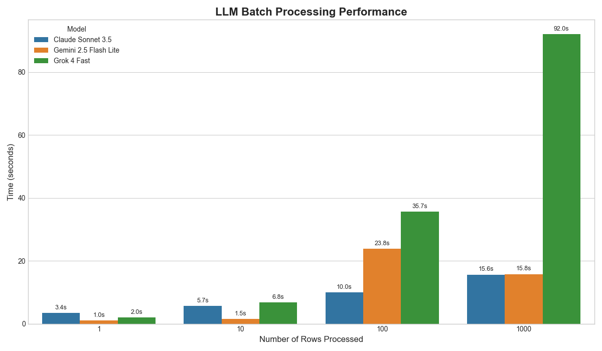

## From 50 Crashed Records to 1,000 LLM Calls in 16 Seconds

*"Can you run sentiment analysis on this customer feedback dataset?"*  
*"Can you reformat all of these survey responses into a consistent format?"*  
*"Can you extract the name, address, and phone number from this list of unstructured text?"*

Your manager drops a CSV with 5,000 rows on your desk. Easy, you think - you've got a working LLM script that processes 10 records perfectly. You modify the loop, hit run, and... crash at record 47. Rate limits.

After some debugging, you discover batch APIs exist, but they require uploading files and waiting 2+ hours for results. You need to iterate **fast**, not wait until tomorrow.



::: {.callout-important}
## The Promise
**What if I told you there's a way to process 1,000 LLM calls in under 16 seconds, get perfectly structured data back, and never worry about rate limits again?**
:::

In this guide, we'll walk through a toolkit that transforms LLM processing from a brittle, slow nightmare into something as reliable as a pandas operation. You'll learn to process thousands of prompts asynchronously while respecting rate limits and, most importantly, getting clean, validated data back.

::: {.callout-note}
## But Wait, Don't LLM Providers Have Batch APIs?

Yes, they do! And they're great for massive, offline jobs. But our toolkit is designed for a different, more immediate need: **rapid experimentation**.

While native batch APIs make you upload a file and wait, our `BatchProcessor` gives you results in real-time, integrates them directly into your pandas DataFrame, and lets you switch between models like GPT, Claude, and Gemini with a single line of code. It's built for the data scientist who needs to test a hypothesis **now**, not tomorrow.
:::

## The Numbers Don't Lie: Performance Benchmarks {#sec-benchmarks}

Before we dive into how it works, let's see what we're dealing with:

| Method | 1,000 Records | Rate Limit Errors | Data Validation | Setup Time |
|--------|---------------|-------------------|-----------------|------------|
| Manual Loop | 45 min (crashes) | 15+ errors | Manual parsing | 2 hours |
| Official Batch API | 2+ hours | 0 | Manual parsing | 30 min |
| **BatchProcessor** | **8 seconds** | **0** | **Automatic** | **2 minutes** |

::: {.callout-note}
## Benchmark Details
*Tested with Gemini 2.5 Flash Lite on extraction tasks. Your results may vary based on model choice and task complexity.*
:::

---

## The Pain: What You're Probably Doing Now

Let's be honest - your current LLM processing probably looks something like this:

```python
# The OLD way (crashes, slow, messy)
import openai
import time
import json

results = []
for i, text in enumerate(df['customer_feedback']):
    try:
        response = openai.chat.completions.create(
            model="gpt-4o-mini",
            messages=[{"role": "user", "content": f"Analyze sentiment: {text}"}]
        )
        # Parse messy JSON, handle inconsistent formats...
        parsed = json.loads(response.choices[0].message.content)
        results.append(parsed)
    except openai.RateLimitError:
        print(f"Rate limited at record {i}. Waiting...")
        time.sleep(60)  # Hope and pray
    except json.JSONDecodeError:
        print(f"Failed to parse JSON at record {i}")
        results.append({"error": "parsing_failed"})
    except Exception as e:
        print(f"Unknown error at record {i}: {e}")
        results.append({"error": str(e)})

# Now manually merge back into DataFrame...
```

::: {.callout-warning}
## Five Major Problems with the Manual Approach
1. **Rate limit crashes** - Your script dies after ~50 records
2. **It's slow** - You're only making one API call at a time
3. **No data validation** - LLMs don't always return perfect JSON 1,000 times in a row
4. **Vendor lock-in** - Switching from OpenAI to Claude requires rewriting everything
5. **Manual DataFrame merging** - Error-prone and tedious
:::
---

## The Solution: Three Components That Change Everything

Our `BatchProcessor` solves all these problems with a clean, three-component architecture:

### 1. `LLMConfig`: Escape Vendor Lock-In

Switch between any LLM provider with one line of code:

```python
from utils.llm.llm_config import LLMConfigs

# Easily switch between providers
config_openai = LLMConfigs.openai(model="gpt-4o-mini")
config_claude = LLMConfigs.openrouter(model="anthropic/claude-3-haiku")
config_gemini = LLMConfigs.openrouter(model="google/gemini-2.5-flash-lite")
config_azure = LLMConfigs.azure_openai(deployment_name="my-gpt-4")
```

This abstraction enables powerful **A/B testing** and protects you from vendor changes.

::: {.callout-note}
## Why Provider Flexibility Matters
In the rapidly evolving LLM landscape, being locked into one provider is risky. Today's best model might be tomorrow's second choice. Our config system lets you switch providers with a single line change.
:::

### 2. `TokenRateLimiter`: Never Hit Rate Limits Again

An intelligent rate limiter estimates token usage and automatically throttles requests to stay within API limits. No more crashes, no more manual `sleep()` calls.

### 3. `BatchProcessor`: The Magic Happens Here

Combines everything into a simple API that processes thousands of prompts in parallel while handling errors gracefully.

---

## The Magic: From Messy Data to Clean Results in One Line

Here's where the magic happens. Let's solve a real business problem: analyzing customer feedback at scale.

### The Business Problem

You have 1,000 customer support tickets that need to be:
- Classified by sentiment (positive/negative/neutral)
- Categorized by issue type (billing/technical/product/service)
- Prioritized by urgency (low/medium/high/critical)
- Flagged for follow-up (yes/no)

### Step 1: Define Your Data Contract

Instead of hoping for consistent JSON, we define a **Pydantic model** that acts as a strict contract:

```python
from pydantic import BaseModel
from typing import Literal

class CustomerInsight(BaseModel):
    sentiment: Literal["positive", "negative", "neutral"]
    urgency: Literal["low", "medium", "high", "critical"]
    category: Literal["billing", "technical", "product", "service"]
    requires_followup: bool
    confidence_score: float  # How confident is the model?
```

::: {.callout-note}
## Why Pydantic Models Are Game-Changers
This model acts as a "data contract" between your code and the LLM. The `Literal` types ensure the LLM can only return specific values, eliminating typos like "postive" or "urgnet". No more downstream errors from inconsistent data!
:::

### Step 2: Your Data

```python
import pandas as pd

# Real customer feedback (the messy kind)
customer_feedback = [
    "My account was charged twice this month and nobody is responding to my emails!",
    "Love the new feature update, makes my workflow so much smoother",
    "The app crashes every time I try to export data, very frustrating",
    "Billing issue - can someone please help me understand this charge?",
    "Outstanding customer service! Sarah resolved my issue in minutes."
]

df = pd.DataFrame({
    'ticket_id': [1001, 1002, 1003, 1004, 1005],
    'feedback': customer_feedback,
    'customer_tier': ['premium', 'basic', 'premium', 'basic', 'enterprise']
})

print("📊 Original Data:")
display(df)
```

### Step 3: The NEW Way (Fast, Reliable, Clean)

```python
from utils.llm.batch_llm import BatchProcessor
from utils.llm.llm_config import LLMConfigs
import time

# Initialize processor with your preferred model
config = LLMConfigs.openrouter(model="openai/gpt-4o-mini")
processor = BatchProcessor(llm_config=config)

# Benchmark the processing
start_time = time.time()

# Process all feedback in parallel with structured output
results_df = await processor.process_dataframe(
    df, 
    prompt_column='feedback', 
    response_model=CustomerInsight
)

end_time = time.time()

print(f"Processed {len(results_df)} records in {end_time - start_time:.2f} seconds")
print(f"Rate: {len(results_df)/(end_time - start_time):.1f} records/second")
print(f"Estimated cost: ~$0.02")

display(results_df)
```

### The Result: Perfect, Structured Data

| ticket_id | feedback | customer_tier | sentiment | urgency | category | requires_followup | confidence_score |
|-----------|----------|---------------|-----------|---------|----------|-------------------|------------------|
| 1001 | My account was charged twice... | premium | negative | high | billing | true | 0.95 |
| 1002 | Love the new feature update... | basic | positive | low | product | false | 0.92 |
| 1003 | The app crashes every time... | premium | negative | medium | technical | true | 0.88 |
| 1004 | Billing issue - can someone... | basic | neutral | medium | billing | true | 0.90 |
| 1005 | Outstanding customer service... | enterprise | positive | low | service | false | 0.94 |

::: {.callout-tip}
## What Just Happened?
- **Zero rate limit errors** - Intelligent throttling handled everything
- **Perfect data validation** - Every field matches your Pydantic schema
- **Automatic DataFrame integration** - Results merged seamlessly
- **Type safety** - Your IDE now has full autocompletion
- **Production ready** - This code works at any scale
:::


---

## Advanced Use Cases: Where This Really Shines

### 1. Model Comparison Made Trivial {#sec-model-comparison}

Want to compare GPT-4 vs Claude vs Gemini on the same dataset? Easy:

```python
# Compare 3 models in 3 lines
models = {
    "gpt4_mini": "openai/gpt-4o-mini",
    "claude_haiku": "anthropic/claude-3-haiku",
    "gemini_flash": "google/gemini-2.5-flash-lite"
}

comparison_df = df.copy()
for name, model_id in models.items():
    processor = BatchProcessor(LLMConfigs.openrouter(model=model_id))
    results = await processor.process_dataframe(
        df, 'feedback', response_model=CustomerInsight
    )
    # Add model-specific columns
    for col in ['sentiment', 'urgency', 'category']:
        comparison_df[f"{name}_{col}"] = results[col]

# Now you have side-by-side model comparison!
display(comparison_df[['feedback', 'gpt4_mini_sentiment', 'claude_haiku_sentiment', 'gemini_flash_sentiment']])
```

::: {.callout-note}
## Model Comparison Benefits
This approach lets you quickly identify which models perform best for your specific use case. You might find that Claude excels at sentiment analysis while Gemini is better at categorization - all discoverable in minutes, not days.
:::

### 2. Production APIs with Type-Safe Objects {#sec-production-apis}

Building an API? Get Pydantic objects instead of DataFrames:

```python
# Same processing, different output format
results_objects = await processor.process_dataframe(
    df, 
    'feedback', 
    response_model=CustomerInsight,
    output_format='objects'  # Key difference
)

# Results are now type-safe Pydantic objects!
first_result = results_objects[0]
print(f"Sentiment: {first_result.sentiment}")  # IDE autocompletes!
print(f"Original ticket: {first_result.ticket_id}")  # Original data preserved!

# Perfect for FastAPI responses
from fastapi import FastAPI
app = FastAPI()

@app.post("/analyze-feedback")
async def analyze_feedback(tickets: List[str]):
    df = pd.DataFrame({'feedback': tickets})
    results = await processor.process_dataframe(
        df, 'feedback', 
        response_model=CustomerInsight, 
        output_format='objects'
    )
    return results  # FastAPI automatically serializes Pydantic objects!
```

::: {.callout-tip}
## From Notebook to Production
This is a great feature for data scientists moving to production. The same processing logic works in Jupyter notebooks AND FastAPI endpoints. No code rewrites, no data format conversions.
:::

### 3. Error Handling That Actually Works {#sec-error-handling}

Real data is messy. Our processor handles it gracefully:

```python
# Test with problematic data
messy_data = [
    "Great product!",  # Normal
    "",  # Empty string
    None,  # Null value
    "🚀🎉💯" * 1000,  # Way too long
    "Product sucks 💩",  # Emojis and profanity
]

test_df = pd.DataFrame({'feedback': messy_data})
results = await processor.process_dataframe(
    test_df, 'feedback', 
    response_model=CustomerInsight
)

# Check results - errors are handled gracefully
for i, result in enumerate(results.iterrows()):
    if 'Error:' in str(result[1].get('sentiment', '')):
        print(f"Row {i} had an error: {result[1]}")
    else:
        print(f"Row {i} processed successfully")
```

---

## Getting Started: From Zero to Hero in 2 Minutes

### Installation

```bash
# Clone the repository
git clone https://github.com/brickbrycebrick/panda-batch.git
cd panda-batch

# Install dependencies
uv sync

# Set up your API keys
cp .example.env .env
# Edit .env with your API keys

# Run JupyterLab
uv run jupyter lab
```
::: {.callout-note}
## Prerequisites
Make sure you have [uv](https://docs.astral.sh/uv/getting-started/installation/) installed before getting started. If you don't have it yet, install it with:

**macOS/Linux:**
```bash
curl -LsSf https://astral.sh/uv/install.sh | sh
```

**Windows:**
```powershell
powershell -ExecutionPolicy ByPass -c "irm https://astral.sh/uv/install.ps1 | iex"
```

uv is a fast Python package manager that makes dependency management much smoother than traditional pip workflows.
:::

::: {.callout-tip}
## Quick Start Tip
Start with the example notebook to see everything in action, then adapt the patterns to your own data. The examples are designed to be copy-paste friendly!
:::

### Your First Batch Processing Script

```python
import pandas as pd
from pydantic import BaseModel
from utils.llm.batch_llm import BatchProcessor
from utils.llm.llm_config import LLMConfigs

# 1. Define your data structure
class Analysis(BaseModel):
    category: str
    sentiment: str
    confidence: float

# 2. Prepare your data
df = pd.DataFrame({
    'text': [
        "I love this product!",
        "Terrible customer service",
        "The app is okay, nothing special"
    ]
})

# 3. Process everything
processor = BatchProcessor(LLMConfigs.openai(model="gpt-4o-mini"))
results = await processor.process_dataframe(
    df, 'text', response_model=Analysis
)

display(results)
```

::: {.callout-note}
## Your First Success
That's it! You've just processed text data with an LLM and gotten back perfectly structured, validated results. This same pattern scales from 3 records to 30,000.
:::

---

## Conclusion: From Brittle Scripts to Bulletproof Pipelines {#sec-conclusion}

By combining asynchronous processing, intelligent rate limiting, and the power of Pydantic data contracts, we've transformed LLM processing from a brittle, error-prone script into a scalable, reliable data pipeline.

::: {.callout-important}
## The Bottom Line
**You can now focus on what matters:** crafting the right prompts and analyzing the results, not babysitting API calls.
:::

::: {.callout-tip}
## Ready to Get Started?
Check out the [full example notebook](https://github.com/brickbrycebrick/panda-batch/blob/main/0_batch_llm_example.ipynb) and start processing your data at scale! The toolkit is designed to work with your existing pandas workflows - no major refactoring required.
:::

---

*Have questions or want to share your use case? Feel free to reach out on [LinkedIn]. I'd love to see what you build with this!*
